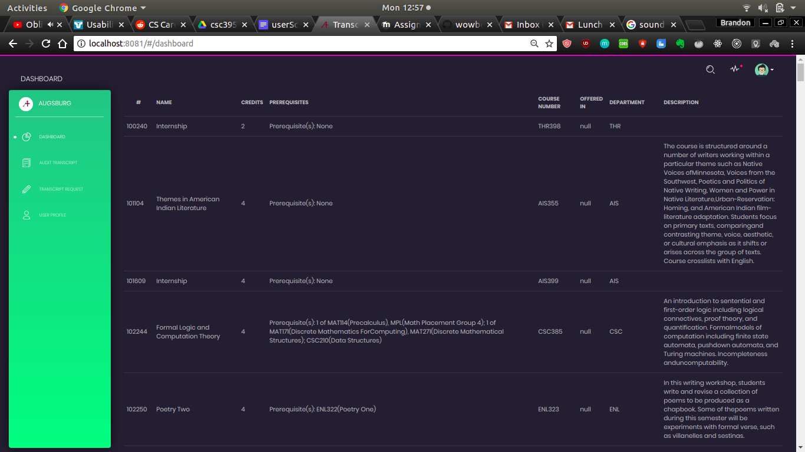
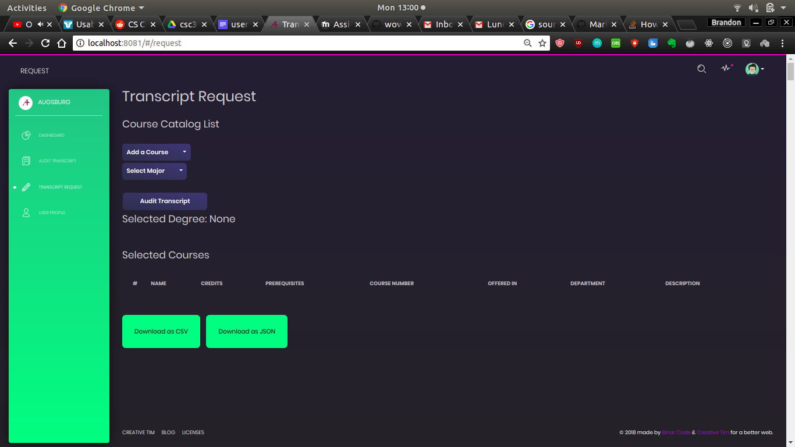
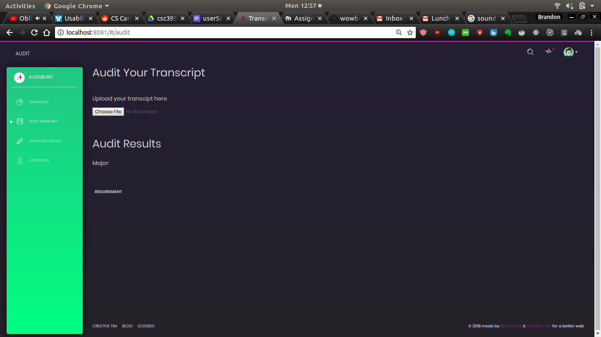

# Welcome to the Transcript Planner!

-------------------------------------------------------------
## The Tech stack

For the Front-end, we are using VueJS with a custom template from Creative Tim.  The source can be found [here.](https://www.creative-tim.com/product/vue-black-dashboard?affiliate_id=104113&ref=madewithvuejs.com#)
For the Back-end, we are using a simple Python Flask app!

## Setup

### Flask App (Back-end)
For the Flask app, you will want to have Python installed, and you will need to run the following commands:

```pip install -U Flask```

```pip install -U flask-cors```

```pip install flask-restful```

To run the Flask app, cd into ```transcriptPlanner/transcriptPlanner``` and run ```python app.py``` 

Documentation on Flask-RESTful can be [found here.](https://flask-restful.readthedocs.io/en/latest/)

### Vue App (Front-end)

For flask you will need [NodeJS](https://nodejs.org/en/) and  the [Yarn Package Manager](https://yarnpkg.com/en/).

After these have been installed, CD into the ```transcriptPlanner/vue-black-dashboard-master``` directory and run the following command to install the dependencies:

```yarn```

If you are on Mac/Linux you might need to run ```sudo``` with the previous command:

```sudo yarn```

After this has completed, you can type the following command within the ```transcriptPlanner/vue-black-dashboard-master``` directory to spin up a front-end web server:

```yarn run dev```

or 

```sudo yarn run dev```

if on Mac/Linux.

### User Manual




### Helpful resources

For help on VueJS itself, you can [go here.](https://vuejs.org/v2/guide/)  It would also be helpful to know about [Axios](https://medium.com/codingthesmartway-com-blog/getting-started-with-axios-166cb0035237), and check out stuff on REST APIs to get a sense of what is going on.

### Tech Summary

Essentially, the Frontend (the Vue app) communicates to the backend (the Flask app) by sending HTTP Requests.  These requests look like:

```localhost:5000/catalog```

And when you ping this URL, you receive a response that is JSON (*J*ava*S*cript *O*bject *N*otation) formatted.  This is where Axios comes in.

Axios is an HTTP client for node.js, and allows us to make calls to our Flask app.

Here is an example Axios call to our Flask app:

```javascript

      axios
        .get("http://127.0.0.1:5000/catalog")
        .then( res => {

          return JSON.parse(res.data);

        })
        .then(res => {
          this.tableInformation['tableData'] = res.courses;

        });
```

The .get() pings our URL, and since the calls are asynchronous, we have to wait for the request to reach out Flask app.  The subsequent .then() calls are used to retrieve the asynchronous data.